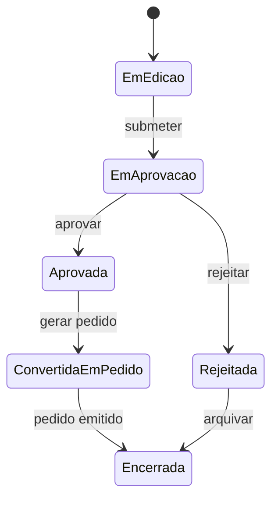

# Requisitos e Processos

## 1. Objetivo do documento

Registrar os requisitos funcionais e nao funcionais do Mini-ERP, alem dos principais casos de uso, regras de negocio e fluxo do processo de compras, recebimento e estoque.

## 2. Fluxo de negocio principal

Fluxo principal proposto:
1. Um solicitante cria uma requisicao de compra com um ou mais itens.
2. Um aprovador analisa a requisicao e registra aprovacao ou rejeicao.
3. Um comprador gera um pedido de compra com base em uma requisicao aprovada.
4. O pedido segue para acompanhamento ate o recebimento.
5. O almoxarife registra o recebimento dos itens.
6. O sistema gera a movimentacao de entrada no estoque.
7. O gestor acompanha status, pendencias e historico.

Representacao resumida:

## 3. Regras de negocio iniciais

- uma requisicao deve possuir ao menos um item
- apenas requisicoes aprovadas podem originar pedido de compra
- um pedido de compra deve estar vinculado a um fornecedor
- recebimento nao pode exceder o saldo pendente do pedido sem justificativa e registro de excecao
- toda entrada de estoque deve estar vinculada a um evento de negocio rastreavel
- usuarios so podem executar acoes compativeis com seu perfil
- aprovacoes e rejeicoes devem registrar autor, data e justificativa

### Diagrama de estados da requisicao de compra

## 4. Requisitos funcionais

### Cadastro e seguranca

- `RF-001`: o sistema deve permitir cadastro e manutencao de produtos
- `RF-002`: o sistema deve permitir cadastro e manutencao de fornecedores
- `RF-003`: o sistema deve permitir cadastro e manutencao de usuarios
- `RF-004`: o sistema deve permitir associar usuarios a perfis de acesso

### Requisicoes de compra

- `RF-005`: o sistema deve permitir criar requisicoes de compra com multiplos itens
- `RF-006`: o sistema deve permitir salvar status de requisicao
- `RF-007`: o sistema deve permitir aprovar ou rejeitar requisicoes
- `RF-008`: o sistema deve permitir registrar justificativa de aprovacao ou rejeicao
- `RF-009`: o sistema deve permitir consultar historico de status da requisicao

### Pedido de compra

- `RF-010`: o sistema deve permitir gerar pedido de compra a partir de requisicao aprovada
- `RF-011`: o sistema deve permitir associar fornecedor e prazo estimado ao pedido
- `RF-012`: o sistema deve permitir acompanhar saldo pendente por item do pedido

### Recebimento e estoque

- `RF-013`: o sistema deve permitir registrar recebimento total ou parcial
- `RF-014`: o sistema deve permitir registrar divergencias de recebimento
- `RF-015`: o sistema deve gerar movimentacao de estoque para recebimentos confirmados
- `RF-016`: o sistema deve permitir consultar saldo atual de estoque por produto
- `RF-017`: o sistema deve permitir consultar historico de movimentacoes por produto

### Auditoria e operacao

- `RF-018`: o sistema deve registrar trilha de auditoria para eventos criticos
- `RF-019`: o sistema deve oferecer dashboard inicial com indicadores operacionais
- `RF-020`: o sistema deve expor API para operacoes principais do dominio

## 5. Requisitos nao funcionais

- `RNF-001`: o sistema deve ser acessivel por teclado e seguir principios essenciais de acessibilidade web
- `RNF-002`: o sistema deve possuir interface responsiva para desktop e tablet
- `RNF-003`: o sistema deve ser conteinerizavel com Docker
- `RNF-004`: a infraestrutura deve ser provisionavel com Terraform
- `RNF-005`: a configuracao e o deploy devem ser automatizaveis com Ansible
- `RNF-006`: o projeto deve ter comandos padronizados via Makefile
- `RNF-007`: o pipeline de CI/CD deve executar build, testes e validacoes minimas
- `RNF-008`: o sistema deve disponibilizar logs estruturados e health checks
- `RNF-009`: o sistema deve possuir controle de acesso baseado em perfis
- `RNF-010`: o sistema deve manter historico auditavel das acoes principais
- `RNF-011`: o projeto deve priorizar simplicidade operacional e baixo custo de execucao
- `RNF-012`: o projeto deve permitir deploy em nuvem por meio de esteira reprodutivel

## 6. Casos de uso

### UC-001 - Criar requisicao de compra

Ator principal: Solicitante

Resultado esperado:
- uma requisicao e registrada em estado inicial
- os itens ficam disponiveis para aprovacao

### UC-002 - Aprovar requisicao

Ator principal: Aprovador

Resultado esperado:
- a requisicao muda para estado aprovado
- a decisao fica registrada com autor e justificativa

### UC-003 - Rejeitar requisicao

Ator principal: Aprovador

Resultado esperado:
- a requisicao muda para estado rejeitado
- a motivacao fica visivel ao solicitante

### UC-004 - Gerar pedido de compra

Ator principal: Comprador

Resultado esperado:
- um pedido de compra e criado a partir de requisicao aprovada
- o pedido fica apto para acompanhamento de recebimento

### UC-005 - Registrar recebimento

Ator principal: Almoxarife

Resultado esperado:
- o sistema registra o recebimento
- o estoque e atualizado conforme a quantidade validada

### UC-006 - Consultar saldo e historico

Ator principal: Almoxarife ou Gestor

Resultado esperado:
- o usuario visualiza saldo atual e movimentacoes anteriores

### UC-007 - Consultar auditoria operacional

Ator principal: Gestor ou Administrador

Resultado esperado:
- eventos criticos do sistema podem ser auditados por usuario, data e entidade

## 7. Excecoes e cenarios alternativos

- recebimento parcial de pedido
- rejeicao de requisicao por falta de aprovacao
- divergencia entre quantidade pedida e recebida
- tentativa de acao sem permissao adequada
- indisponibilidade temporaria de algum componente no deploy

## 8. Rastreabilidade inicial

Mapeamento resumido:
- compras: `RF-005` a `RF-012`
- estoque: `RF-013` a `RF-017`
- governanca e operacao: `RF-018` a `RF-020` e `RNF-003` a `RNF-012`
- experiencia e acessibilidade: `RNF-001` e `RNF-002`

## 9. Pontos para refinamento posterior

- definir ciclo de vida exato dos status das entidades
- detalhar politicas de aprovacao
- definir politicas de ajuste manual de estoque
- decidir se dashboard faz parte do MVP tecnico ou da iteracao seguinte
