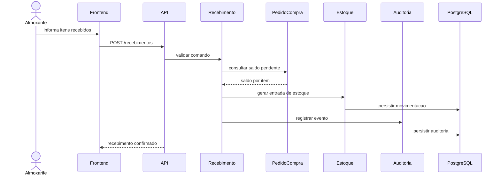
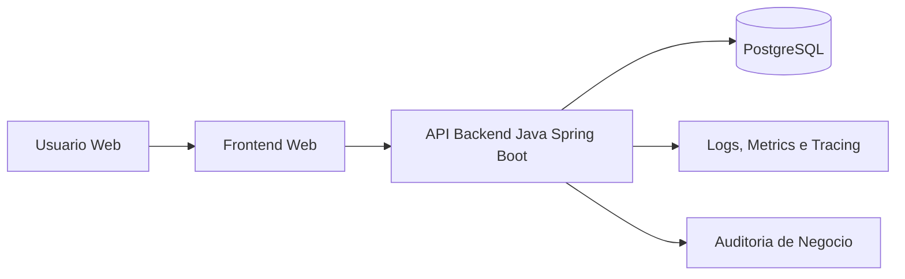
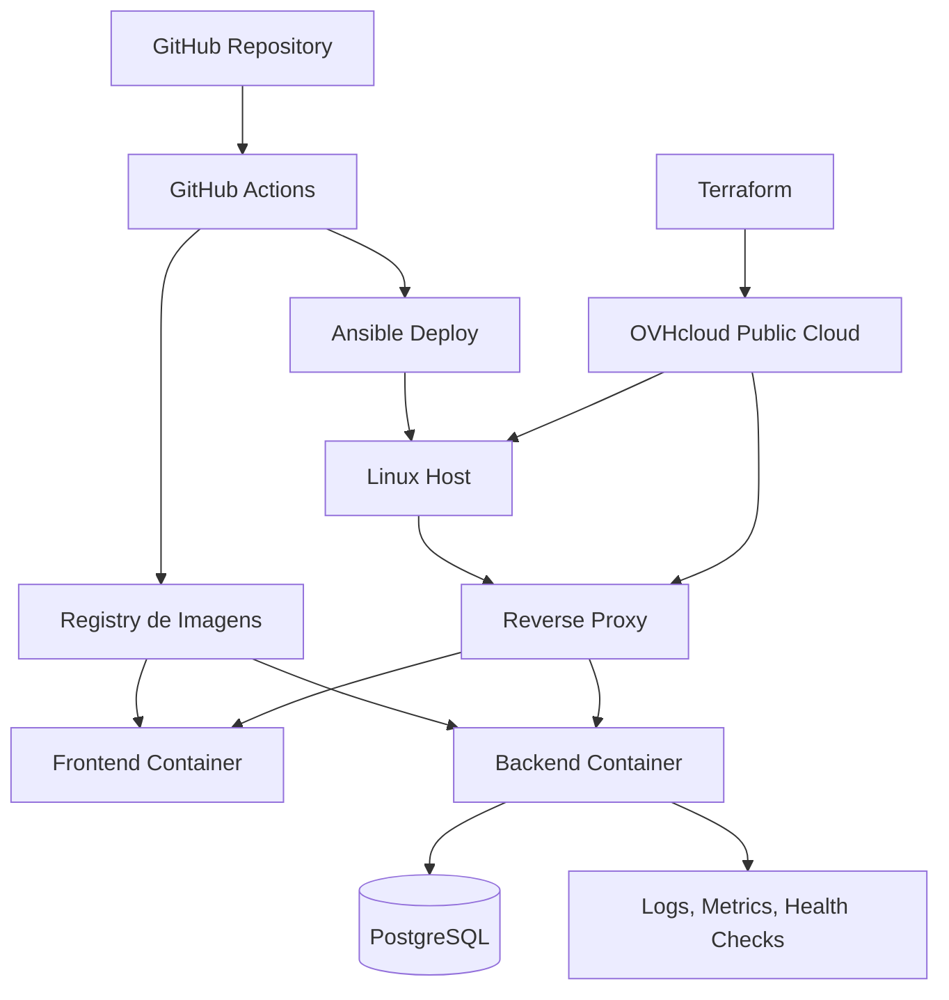
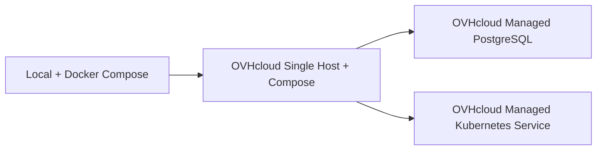

# Arquitetura

## 1. Objetivo do documento

Descrever a arquitetura candidata do sistema, com foco em separacao de responsabilidades, operabilidade, entrega continua e clareza para evolucao futura.

## 2. Direcionadores arquiteturais

- foco em aprendizado pratico de engenharia de software e DevOps
- simplicidade operacional sem perder qualidade tecnica
- rastreabilidade de eventos de negocio
- baixo acoplamento entre modulos de dominio
- facilidade de deploy local e em nuvem
- automacao como parte do produto tecnico

## 3. Visao de arquitetura candidata

Direcao inicial proposta:
- backend em Java com Spring Boot como stack principal
- API HTTP para operacoes do dominio
- frontend web separado do backend em termos de entrega
- banco relacional para persistencia transacional
- conteinerizacao com Docker
- provisionamento com Terraform
- configuracao e deploy com Ansible
- automacoes operacionais complementares com Shell Script e Python quando fizer sentido
- automacao local por Make
- pipeline de CI/CD no GitHub
- nuvem principal na OVHcloud

Decisao candidata principal:
- adotar um monolito modular no backend, evitando microservicos no inicio

Referencia:
- [ADR-001-monolito-modular-devops-first.md](./adr/ADR-001-monolito-modular-devops-first.md)
- [ADR-004-adotar-ovhcloud-single-host-com-evolucao-para-kubernetes.md](./adr/ADR-004-adotar-ovhcloud-single-host-com-evolucao-para-kubernetes.md)

## 4. Visao logica

Modulos de negocio propostos:
- identidade e acesso
- cadastro de produtos
- cadastro de fornecedores
- requisicao de compra
- aprovacao
- pedido de compra
- recebimento
- estoque
- auditoria
- dashboard e relatorios operacionais

Camadas sugeridas:
- `frontend`: experiencia do usuario, acessibilidade e navegacao
- `api`: contratos HTTP, autenticacao e validacao de entrada
- `application`: casos de uso e orquestracao
- `domain`: regras de negocio e entidades
- `infrastructure`: persistencia, mensageria futura, observabilidade e integracoes

### Sequencia tecnica critica: registrar recebimento

## 5. Visao de contexto

## 6. Visao de deploy candidata

Arquitetura operacional inicial sugerida:
- um ambiente local com containers para desenvolvimento
- um ambiente remoto em OVHcloud Public Cloud para validacao e demonstracao
- um host Linux unico no primeiro deploy
- um reverse proxy na borda
- frontend e backend empacotados e entregues separadamente
- banco PostgreSQL em container no primeiro deploy, com evolucao planejada para servico gerenciado
- Docker Compose como runtime inicial do ambiente remoto

Possivel topologia inicial:

### Evolucao arquitetural planejada

Topologia alvo de evolucao:
- migrar de Docker Compose em host unico para orchestracao em Kubernetes
- avaliar OVHcloud Managed Kubernetes Service para provas praticas de orquestracao
- avaliar migracao do banco para Managed PostgreSQL da OVHcloud
- manter o mesmo modelo de pipeline, observabilidade e principios de configuracao por ambiente

Representacao resumida da evolucao:

## 7. Ambientes

Ambientes desejados:
- `local`: desenvolvimento e testes rapidos
- `dev`: integracao tecnica
- `staging`: validacao de release e demonstracao
- `prod`: ambiente final de portfolio ou apresentacao

Observacao:
- a quantidade final de ambientes pode ser reduzida para manter viabilidade, mas a esteira deve suportar ao menos `local` e `dev`

## 8. DevOps e operacao

### Build e automacao local

Responsabilidades do `Makefile`:
- padronizar build, testes e execucao local
- encapsular comandos de Docker, Terraform e Ansible
- reduzir variacao de uso entre ambientes

Comandos esperados futuramente:
- `make dev`
- `make test`
- `make lint`
- `make build`
- `make docker-build`
- `make infra-plan`
- `make infra-apply`
- `make deploy`
- `make smoke`

### CI/CD

Esteira desejada:
1. validacao de formato e qualidade
2. build do backend Spring Boot e do frontend
3. execucao de testes automatizados
4. empacotamento em imagens Docker
5. publicacao de artefatos
6. deploy automatizado em ambiente alvo
7. smoke tests pos-deploy
8. coleta de evidencias operacionais da release

### Observabilidade

Capacidades desejadas:
- logs estruturados
- health checks
- metricas basicas de aplicacao e infraestrutura
- rastreamento basico de fluxo tecnico
- correlacao de eventos de auditoria com acoes de negocio
- estrategia de analise de falhas de startup, memoria, timeout e latencia
- runbooks curtos para incidentes comuns

### Seguranca

Minimos esperados:
- autenticacao
- autorizacao baseada em perfis
- segregacao de configuracoes por ambiente
- tratamento seguro de segredos
- protecao basica de endpoints administrativos
- definicao explicita de portas, DNS, proxy reverso e superficie de exposicao
- reforco de fundamentos de rede e seguranca operacional

### Acessibilidade

O frontend deve considerar desde o inicio:
- navegacao por teclado
- foco visivel
- formularios com labels e mensagens de erro adequadas
- semantica de tabelas e controles
- contraste e nao dependencia exclusiva de cor

### Runtime e suporte a operacao

Objetivos operacionais:
- demonstrar como uma aplicacao Spring Boot sobe, e configurada e e operada
- permitir troubleshooting basico de startup, integracao, rede, memoria e performance
- manter artefatos de deploy, logs e configuracao acessiveis para diagnostico

Artefatos esperados ao longo da implementacao:
- `Dockerfile` do backend e do frontend
- `docker-compose.yml` para ambiente local e remoto inicial
- playbooks Ansible de bootstrap e deploy
- scripts Shell e Python para automacoes operacionais pontuais
- pipeline GitHub Actions com build, testes, imagem e deploy
- runbooks de diagnostico e rollback

## 9. Decisoes em aberto

- framework do frontend
- estrategia de autenticacao inicial
- profundidade de observabilidade do MVP
- ponto exato de entrada da validacao em Kubernetes

## 10. Criterios de aceitacao arquitetural

- a arquitetura deve ser explicavel de forma simples
- o sistema deve poder ser executado localmente e em nuvem com o mesmo modelo conceitual
- o deploy deve ser reprodutivel
- modulos devem permitir evolucao sem acoplamento excessivo
- requisitos de operacao devem estar presentes desde o MVP
- a aplicacao Java deve poder ser diagnosticada e operada em ambiente Linux
- a arquitetura deve deixar clara a trilha de evolucao de Compose para Kubernetes
