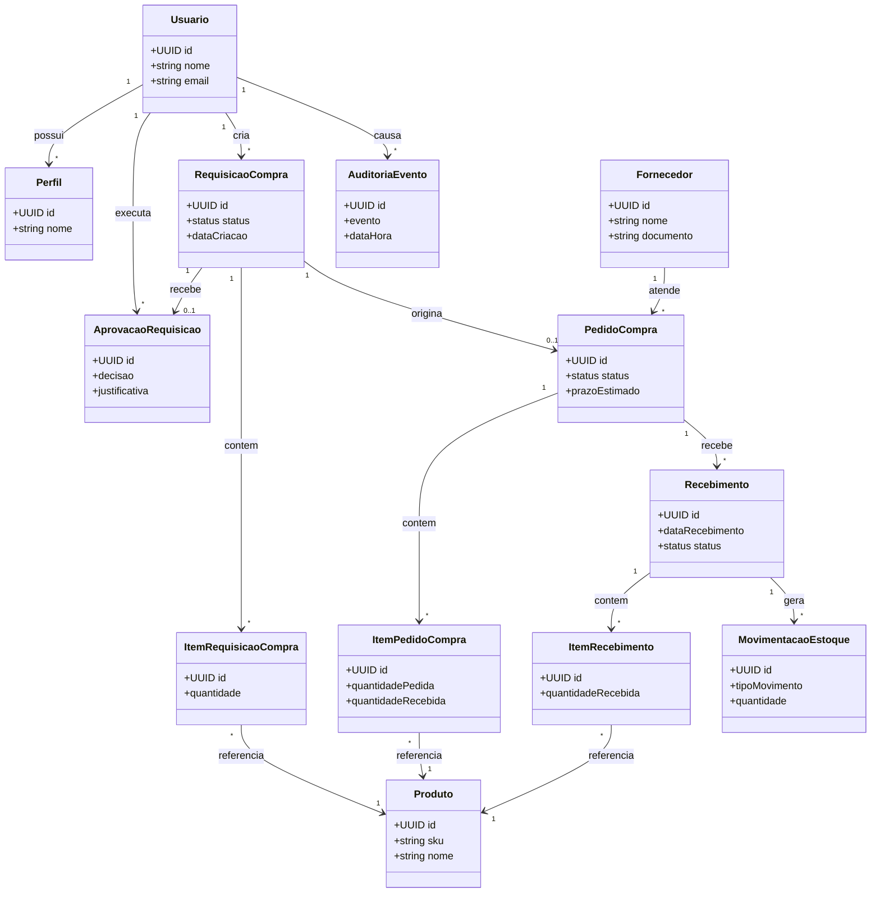

# Dados e Qualidade

## 1. Objetivo do documento

Consolidar o modelo conceitual de dados, as principais entidades de dominio e a estrategia de testes e qualidade do projeto.

## 2. Modelo conceitual inicial

Entidades principais:
- `Usuario`
- `Perfil`
- `Produto`
- `Fornecedor`
- `RequisicaoCompra`
- `ItemRequisicaoCompra`
- `AprovacaoRequisicao`
- `PedidoCompra`
- `ItemPedidoCompra`
- `Recebimento`
- `ItemRecebimento`
- `MovimentacaoEstoque`
- `AuditoriaEvento`

Relacionamentos conceituais:
- um `Usuario` possui um ou mais `Perfis`
- uma `RequisicaoCompra` pertence a um solicitante e possui varios itens
- uma `AprovacaoRequisicao` referencia uma requisicao e um aprovador
- um `PedidoCompra` deriva de uma requisicao aprovada
- um `PedidoCompra` possui itens vinculados a um `Fornecedor`
- um `Recebimento` referencia um pedido e gera `MovimentacaoEstoque`
- cada evento relevante gera um `AuditoriaEvento`

### Diagrama conceitual do dominio

## 3. Regras de modelagem

- entidades de negocio devem refletir linguagem do dominio
- transacoes devem preservar consistencia do fluxo principal
- movimentacoes de estoque nao devem existir sem referencia de origem
- auditoria nao deve depender de planilhas ou registros externos
- status das entidades devem ser modelados explicitamente

## 4. Modelo de dados inicial por area

### Identidade e acesso

Dados esperados:
- usuario
- perfil
- associacao usuario-perfil

### Catalogo

Dados esperados:
- produto
- fornecedor

### Compras

Dados esperados:
- requisicao de compra
- item da requisicao
- aprovacao da requisicao
- pedido de compra
- item do pedido

### Recebimento e estoque

Dados esperados:
- recebimento
- item recebido
- movimentacao de estoque

### Governanca

Dados esperados:
- evento de auditoria

## 5. Riscos de dados a considerar

- duplicidade de produtos ou fornecedores
- inconsistencias entre quantidade pedida e recebida
- atualizacao incorreta de saldo de estoque
- perda de rastreabilidade entre pedido e movimentacao
- falta de historico para auditoria

## 6. Estrategia de testes

Pirâmide de testes proposta:
- testes unitarios para regras de dominio
- testes de integracao para repositorios e persistencia
- testes de API para contratos e autorizacao
- testes end-to-end para o fluxo principal
- testes de infraestrutura e smoke tests para deploy
- testes de startup, configuracao e runtime do Spring Boot
- testes operacionais de observabilidade, backup e rollback quando aplicavel

Cobertura minima desejada:
- regras criticas de dominio com testes automatizados
- fluxo principal do sistema validado de ponta a ponta
- pipeline impedindo promocao de artefatos quebrados
- endpoints de health check e logs validos no ambiente remoto
- casos basicos de troubleshooting reproduziveis e documentados

## 7. Casos de teste iniciais

- `CT-001`: criar requisicao com multiplos itens validos
- `CT-002`: impedir criacao de requisicao sem itens
- `CT-003`: aprovar requisicao e registrar justificativa
- `CT-004`: rejeitar requisicao e preservar historico
- `CT-005`: impedir geracao de pedido para requisicao nao aprovada
- `CT-006`: registrar recebimento parcial
- `CT-007`: atualizar saldo de estoque apos recebimento confirmado
- `CT-008`: impedir acesso de usuario sem permissao ao fluxo de aprovacao
- `CT-009`: registrar evento de auditoria para acao critica
- `CT-010`: executar deploy e validar health check
- `CT-011`: subir a aplicacao Spring Boot com configuracao valida no ambiente Linux
- `CT-012`: detectar falha de integracao por variavel ausente no deploy
- `CT-013`: validar geracao de logs estruturados para request e erro
- `CT-014`: validar rollback basico da stack apos falha de deploy
- `CT-015`: executar teste de carga leve e observar latencia e consumo de recursos

## 8. Criterios de qualidade

Definicao de pronto para incremento relevante:
- documentacao impactada atualizada
- testes automaticos relacionados executando com sucesso
- logs e mensagens de erro minimamente compreensiveis
- requisito de acessibilidade considerado na tela entregue
- impacto operacional conhecido
- observabilidade minima considerada quando a mudanca afetar runtime ou deploy
- procedimentos de troubleshooting atualizados quando a mudanca alterar operacao

Qualidades prioritarias:
- corretude funcional
- rastreabilidade
- manutenibilidade
- deploy reprodutivel
- observabilidade
- operabilidade
- debuggabilidade
- desempenho basico monitoravel
- acessibilidade

## 9. Pontos para detalhamento futuro

- diagrama entidade-relacionamento detalhado
- estrategia de versionamento de schema
- retencao de logs e auditoria
- massa de dados para testes e demonstracoes
- estrategia de testes de performance e tuning
- runbooks e postmortems de incidentes simulados
